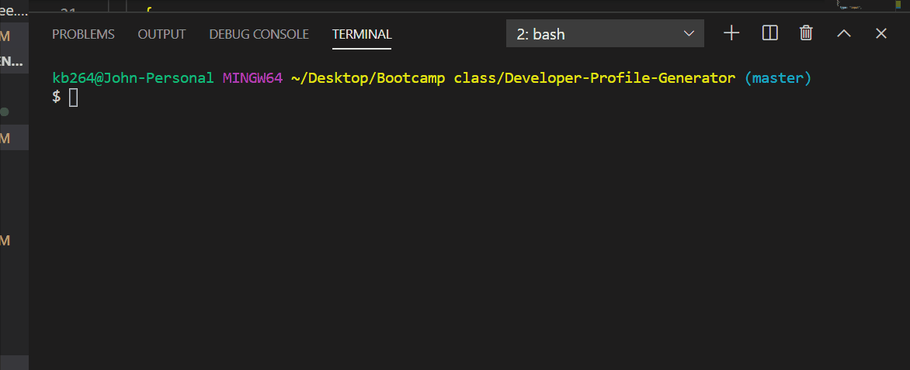

# Title: Developer-Profile-Generator

  ## Description

 a command-line application that dynamically generates a README.md from a user's input.

 The user will be prompted for their GitHub username, which will be used to make a call to the GitHub API to retrieve their Avatar image. 

  ## Video demonstration : 

  
  
  
